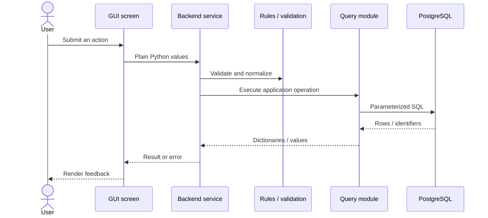

# Architecture

Assignment Assessor is organized as a layered desktop application. The goal is
to keep interface code expressive without coupling business rules to
CustomTkinter or PostgreSQL.

## Request flow



## Layer responsibilities

### `gui_logic`

Screen composition and event handling:

- Creates and positions widgets
- Reads entry, selector, and button values
- Controls navigation and selected states
- Converts backend states into display text and colors

Screens should not hash passwords, calculate priorities, parse database dates,
or execute SQL.

The Add Task screen uses a full-width scrollable form with nested layout
sections. Status and assignment-name controls span the form, course and
date/time controls share a compact row, and optional description and tag
controls continue below. `tkcalendar.DateEntry` remains presentation-layer
input; submission and date normalization belong in the service boundary.

### `gui_widgets`

Reusable visual behavior:

- `DashboardCard` encapsulates card layout, parent-matched accent styling,
  hover, click, and responsive text
- `enable_linux_mousewheel` provides platform-specific scroll behavior and
  safely traverses composite CustomTkinter widgets that reject direct bindings

A component belongs here when it is reused or contains meaningful widget
behavior. One-off screen layouts stay in `gui_logic`.

### `backend`

Application workflows and deterministic rules:

- `auth_service.py` coordinates registration, authentication, and session state
- `course_service.py` exposes course availability
- `task_service.py` coordinates task querying, filtering, searching, summaries,
  and dashboard data
- `task_rules.py` owns statuses, priority calculations, and workload rules
- `validation.py` owns input and date validation
- `auth.py` contains password hashing and credential primitives
- `session.py` owns the current authenticated user

Backend modules do not import GUI packages or presentation tokens.

### `database`

Persistence details:

- Opens PostgreSQL connections
- Executes parameterized SQL
- Converts database rows into application dictionaries
- Raises failures when writes affect no records

The schema snapshot documents tables, constraints, and relationships. DataGrip
is used as the authoritative schema-management interface.

## Domain decisions

### Task status

Tasks use three explicit states:

```text
not_started → in_progress → completed
```

A PostgreSQL check constraint prevents unsupported values.

### Course ownership

Tasks retain both `user_id` and `course_id`. A composite foreign key references
`courses(user_id, course_id)`, preventing cross-user course assignment.

### Course history

Courses use `is_active` for archiving. Historical tasks retain their course
relationship while inactive courses disappear from new-assignment choices.

### Priority

Priority is based on remaining work:

```text
(difficulty × max(estimated hours - hours used, 0)) / days remaining
```

Today and overdue assignments use one day to avoid division by zero.

## Testing strategy

Unit tests focus on:

- Authentication primitives and workflows
- Session requirements
- Task construction, validation, and priority rules
- Filtering, searching, dashboard summaries, and course services

Services are tested by replacing query dependencies with small fakes. This
keeps the active suite fast and independent of local database configuration.

Database integration tests are planned as a separate suite.

## Legacy boundary

The original CLI prototype lives in `legacy/`. Active desktop modules never
import from that package. It remains available as a record of the project's
evolution without constraining the current architecture.
